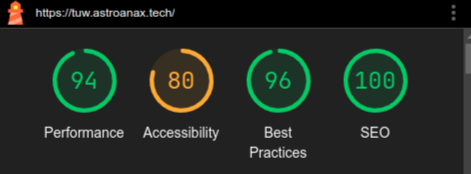
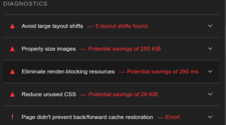

# Project Submission for Team Unwired

This repository contains the submission of Special Induction Round - Web Development for Team Unwired.

This project has been made using [SvelteKit](https://kit.svelte.dev/) as a non-framework, along with [Tailwind CSS](https://tailwindcss.com/) and [Skeleton UI](https://www.skeleton.dev) for ease of CSS rules and themeing.

For the image carousel, [Slidy](https://slidy-core.surge.sh) was used, and for the NavBar component, [Flowbite Svelte](https://flowbite-svelte.com/) was used.

## Lighthouse results

Lighthouse results are mostly fine - performance takes a hit due to loading of remote fonts, as well lack of a strictly defined layout.

Accessibility is nothing too much important - the aria-roles for the image carousel aren't configured properly. Apart from that, "Touch targets do not have sufficient space or sizing" for the thumbnails of the carousel. This can safely be ignored.

Best practices isn't 100 since matomo logged errors (my browser blocks tracking) to the console.

And SEO was easy.

## Matomo analytics

Analytics are configured for matomo. Right now, it shows visitors only, can be improved further. Didn't opt for google analytics since it was privacy invasive.
